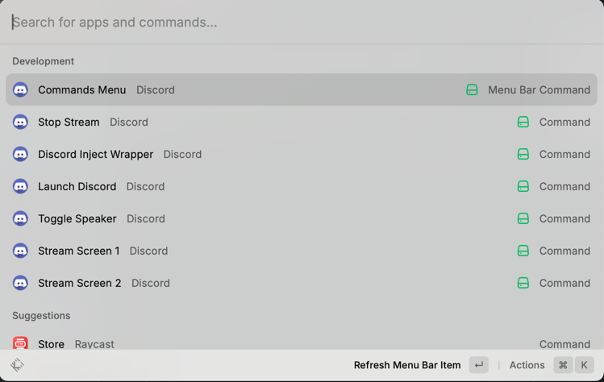
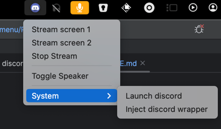

# Raycast Discord commands and menu bar

Tested on MacOS

Communications between raycast extension and discord are made through devTools remote debugging en discord app, so discord application must be either launched through:
- menu `System`>`Launch Discord`
- `open /Applications/Discord.app/Contents/MacOS/Discord --args '--remote-debugging-port=5656 --remote-allow-origins="*"'`




## Installation

```
cd ~/src
git clone https://github.com/micoli/raycast-discord-menu
cd raycast-discord-menu
npm install && npm run dev
```

