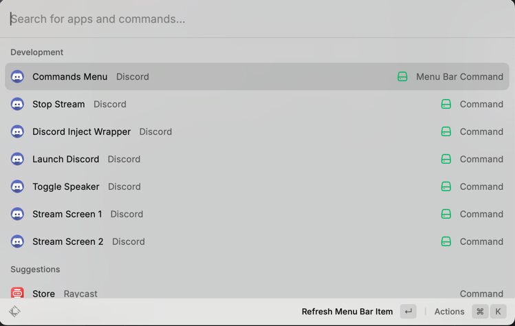
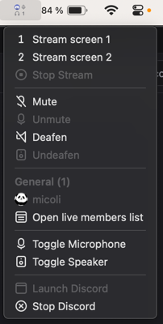

# Raycast Discord commands and menu bar

Tested on MacOS

Communications between raycast extension and discord are made through devTools remote debugging en discord app, so discord application must be either launched through:
- menu `System`>`Launch Discord`
- `open -a Discord --args --remote-debugging-port=5656 --remote-allow-origins=*`

The injected script is installed automatically by the first command (and after each Discord reload).
Discord needs the macOS `Screen & System Audio Recording` permission to list screens in the share picker.

Commands: stream screen 1 / 2, stop stream, toggle / mute / unmute microphone, toggle / deafen / undeafen speaker, voice members (who is in your current voice channel).




## Installation

```
cd ~/src
git clone https://github.com/micoli/raycast-discord-menu
cd raycast-discord-menu
npm install && npm run dev
```

